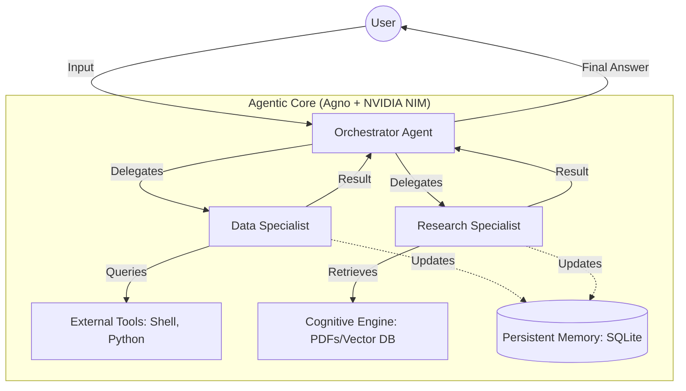

# 🏗️ High-Level Design (HLD) - Titan Intelligence Hub

This document outlines the architecture and flow of the Agno-based agentic systems within this repository.

## 1. System Architecture Overview

The system is designed as a **Modular Multi-Agent Ecosystem**. Each functional engine (Foundations, Orchestration, Collaboration, Cognitive) builds upon the last to create complex, autonomous applications.

## 2. Component Breakdown

### 🧠 Model Layer (The Brain)
*   **Provider**: NVIDIA NIM
*   **Model**: `meta/llama-3.1-8b-instruct` (Optimized for ultra-fast latency)
*   **Role**: Handles high-speed reasoning, tool selection, and natural language generation.

### 🛠️ Tool Layer (The Hands)
*   **Search**: DuckDuckGo, Arxiv, Google Search
*   **System**: Shell Tools, Local File System
*   **Data**: Pandas, Matplotlib, Python REPL

### 📖 Knowledge Layer (The Memory)
*   **Session Memory**: SQLite/Json-based history storage.
*   **Cognitive Memory (RAG)**: LanceDB integration for high-performance semantic search on unstructured data.

### 🔗 Workflow Layer (The Logic)
*   **Linear/Sequential**: Step-by-step task execution.
*   **Concurrent/Parallel**: Batch processing for high-velocity outputs.
*   **Recursive/Looping**: Iterative refinement and error correction.

## 3. Data Flow

1.  **Request**: User sends a query (e.g., "Analyze car sales data and generate a report").
2.  **Reasoning**: The Orchestrator determines which specialist agents or tools are required.
3.  **Execution**: Specialized agents execute Python code, call web tools, or query the cognitive engine.
4.  **Consolidation**: The Orchestrator merges multiple data points into a cohesive, premium response.
5.  **Persistence**: The session state is persisted across interactions for long-term intelligence.
