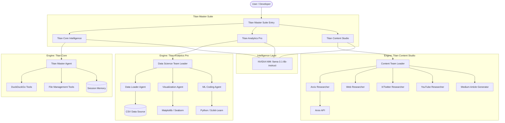

# Titan AI Suite - High Level Design (HLD)

## 1. Project Overview
The **Titan AI Suite** is a comprehensive, production-grade multi-agent ecosystem built on the **Agno** framework. It leverages **NVIDIA NIM (Microservices)** to provide high-performance, specialized AI intelligence across three core domains:
- **Titan Core Intelligence**: Master agents for general research and orchestration.
- **Titan Analytics Pro**: Specialized agents for data science, EDA, and machine learning pipelines.
- **Titan Content Studio**: Multi-source research agents for content generation and article creation.

## 2. System Architecture

## 3. Core Components

### 3.1 Titan Core Intelligence
- **Focus**: General-purpose cognitive tasks, rate-limited research, and persistent session management.
- **Key Features**: 
    - Advanced Rate Limiting (decorator-based).
    - Latency and Usage tracking metrics.
    - SQLite session persistence.

### 3.2 Titan Analytics Pro
- **Focus**: Automating the Data Science pipeline.
- **Agents**:
    - **Data Loader**: Reads and previews CSV files.
    - **Visualization**: Generates statistical plots.
    - **Coding Agent**: Writes and executes ML code.
    - **Shell Agent**: Manages environment dependencies.

### 3.3 Titan Content Studio
- **Focus**: Multi-modal research and automated content publishing.
- **Agents**:
    - **Research Suite**: Arxiv, X, Reddit, Wikipedia, YouTube.
    - **Content Engine**: Transforms research into Medium-style articles.
    - **Delivery**: Drafts emails via Gmail integration.

## 4. Technical Stack
- **Framework**: Agno
- **LLM Provider**: NVIDIA NIM (Meta Llama 3.1 8B Instruct)
- **Persistence**: SQLite (Local)
- **Environment**: Conda (`agent` env)
- **Data Handling**: Pandas, Scikit-Learn
- **UI/API**: FastAPI / AgentOS Dashboard

## 5. Deployment & Execution
The suite is designed to be run as a modular system. Users can launch specific engines or use the unified master entry point to orchestrate complex workflows across all three domains.
